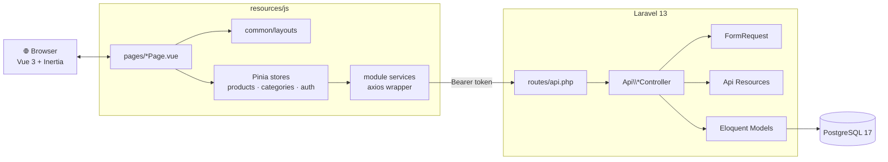
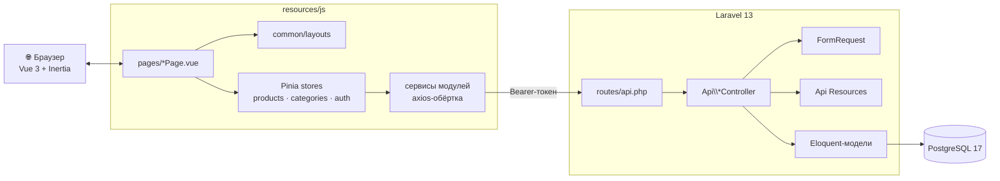

<div align="center">

# 🛍️ BTH Catalog

A modern product catalog with a Sanctum-protected admin panel —
built for the **Junior Full-Stack Developer (Laravel + Vue.js)** test task.

<p>
  
  
  
  
  
</p>
<p>
  
  
  
  
  
</p>

**[🇬🇧&nbsp;English](#-english)&nbsp;·&nbsp;[🇷🇺&nbsp;Русский](#-русский)**

</div>

---

<a id="-english"></a>

## 🇬🇧 English

### ✨ What this is

A Laravel **REST API** paired with a **Vue 3 SPA** served through
Inertia, backed by PostgreSQL. A public catalog, an admin panel gated
by Sanctum bearer tokens, bilingual product data, a cached state layer
and a polished UI with both light and dark themes.

### 🎯 Highlights

| | |
|---|---|
| 🛍️ **42 real products** | Sony WH-1000XM5, MacBook Air M3, Levi's 501, Dyson V15 … curated across 8 categories, each with a thematic image |
| 🌗 **Light / dark theme** | Toggle persists in `localStorage`; a tiny inline script in `<head>` prevents the white flash on reload |
| 🌍 **EN / RU i18n** | Full UI translation via `vue-i18n`; product names and descriptions are stored bilingually |
| ⚡ **Pinia cache** | Normalised `byId` store plus a list cache keyed by filter params — revisiting a list does **zero** network work |
| 🔗 **URL-synced state** | Page, category, and search term survive reload and browser-back |
| 🔐 **Hardened login** | `POST /api/login` is rate-limited to 6 attempts / minute, tokens stored in `localStorage`, 401 auto-clears the session |
| 🧪 **17 feature tests** | CRUD happy paths, auth, validation, 404, rate-limit — all green |

### 🛠️ Tech stack

**Backend**  Laravel 13 · PHP 8.4 · Sanctum · Laravel Pint · PHPUnit 12
**Frontend** Vue 3 (Composition API, TypeScript) · Inertia 2 · Pinia 3 · Tailwind 3 · vue-i18n 11 · Heroicons · Vite 8
**Database** PostgreSQL 17 (in Docker)
**Dev tooling** ESLint 9 (flat config) · Prettier 3 · `prettier-plugin-tailwindcss`

### 🚀 Quick start

```bash
# 1. PHP + JS dependencies
composer install
npm install

# 2. Environment
cp .env.example .env
php artisan key:generate

# 3. PostgreSQL in Docker
docker compose up -d

# 4. Schema + demo data (1 admin, 8 categories, 42 products with images)
php artisan migrate --seed

# 5. Run it
npm run dev                     # Vite HMR on :5173
php artisan serve --port=8000   # or use Laravel Herd for http://<folder>.test
```

Open **http://localhost:8000** (or the Herd domain). Admin credentials
are shown on the login screen:

```
admin@admin.test · password
```

> Deeper dev-environment notes (WebStorm config, conventions) live in
> [`SETUP.md`](./SETUP.md).

### 🗺️ API reference

**Public**

| Method | Route | Notes |
|--------|-------|-------|
| `POST` | `/api/login`         | `{ email, password }` → `{ token, user }`. Rate-limited **6/min/IP** |
| `GET`  | `/api/categories`    | Full list, no pagination (for dropdowns) |
| `GET`  | `/api/products`      | `?page`, `?per_page` (≤50, default 12), `?category_id`, `?search` |
| `GET`  | `/api/products/{id}` | 404 via route model binding |

**Protected** — `Authorization: Bearer <token>`

| Method | Route | Returns |
|--------|-------|---------|
| `POST`      | `/api/logout`           | `204 No Content` — current token revoked |
| `GET`       | `/api/me`               | `{ id, email, name }` |
| `POST`      | `/api/products`         | `201 Created` + `ProductResource` |
| `PUT/PATCH` | `/api/products/{id}`    | `200 OK` + `ProductResource` |
| `DELETE`    | `/api/products/{id}`    | `204 No Content` (soft delete) |

**Validation on write operations**

```
name          required, string, max 255
price         required, numeric, > 0
category_id   required, integer, must exist in categories
name_en, description, description_en, image_url   optional
```

### 🧭 Page map

| Route | Page | Guard |
|-------|------|-------|
| `/`                            | Catalog with pagination, filter, debounced search | public |
| `/product/{id}`                | Detail view                                       | public |
| `/login`                       | Admin login (calls `/api/login`)                  | public |
| `/admin/products`              | Table with Edit / Delete / Add                    | token  |
| `/admin/products/create`       | New product (bilingual fields + image URL)        | token  |
| `/admin/products/{id}/edit`    | Edit existing                                     | token  |

### 🧩 Architecture at a glance



### 📁 Source layout

```
app/
├── Http/
│   ├── Controllers/Api/   AuthController · ProductController · CategoryController
│   ├── Middleware/        HandleInertiaRequests
│   ├── Requests/Api/      LoginRequest · StoreProductRequest · UpdateProductRequest
│   └── Resources/         ProductResource · CategoryResource
└── Models/                User · Category · Product

database/
├── factories/  migrations/  seeders/     (8 categories, 42 curated products)

resources/js/
├── core/       # app entry, axios client, i18n, theme, shared types
├── common/     # shared UI — components · layouts · helpers · composables
├── modules/    # feature-based: auth · categories · products
│   └── <module>/
│       ├── components/  composables/  models/  services/  store/
│       └── index.ts     ← public API
└── pages/      # Inertia pages (PascalCase *Page.vue)

routes/
├── api.php    # REST endpoints
└── web.php    # Inertia page shells
```

Modules expose a strict **public API** via their `index.ts`; nothing
outside a module is allowed to reach into its `services/` or
`helpers/`.

### 🧪 Testing & quality

```bash
php artisan test            # 17 passing · 63 assertions
npm run type-check          # vue-tsc
npm run lint                # ESLint --fix
npm run format              # Prettier
./vendor/bin/pint           # PHP code style
```

Feature tests cover: list pagination & shape, category filter, search,
single-product `200` / `404`, write endpoints require auth, validation
fields, `201` on create, update persists, delete is soft, login happy
/ bad / missing-fields / throttled paths.

### ✅ Spec checklist

<details>
<summary><b>All required items (click to expand)</b></summary>

**Backend** — Laravel 13 REST API, `Product` & `Category` with
required columns and `belongsTo`/`hasMany`; all five product endpoints
plus `GET /api/categories`; Resource controllers + Form Request
validation; Sanctum with `POST /api/login`; GET routes public, writes
gated; validation on `name` / `price > 0` / `category_id exists`.

**Frontend** — Vue 3 Composition API + Inertia + Tailwind; public `/`
with paginated list, `/product/{id}` detail, category dropdown with
AJAX; login page stores token in `localStorage`; menu with "Manage
products" + "Log out"; `/admin/products` with Edit/Delete/Add; form
with name input, category select (from `GET /api/categories`),
description textarea, price number; frontend validation; redirect to
admin list after save.

**Evaluation** — clean commit history (44+ Conventional Commits),
Eloquent with `with('category')`, clear Controller/Model/FormRequest
split, accurate HTTP codes (200/201/204/401/404/422/429), Resources on
every response, heavy use of `ref` / `reactive` / `computed` / `watch`,
global state via Pinia, structured API error handling.

</details>

<details>
<summary><b>Bonuses (click to expand)</b></summary>

✅ Docker & docker-compose (PostgreSQL)
✅ Soft Deletes on `Product`
✅ Seeders (8 categories, 42 real-world products with images)
✅ 17 feature tests
✅ Composables: `useProductsApi`, `useCategories`, `useAuth`, `useDebouncedRef`, `useLocalized`
✅ Polished responsive UI with Tailwind, **dark mode toggle**, **EN/RU i18n toggle**
✅ Delete confirmation modal
✅ Debounced (400 ms) search — server-side LIKE filter

**Extras beyond spec:** Pinia normalised cache with mutation-aware
invalidation · URL-synced filter/page/search state · rate-limited
login · bilingual product data · ESLint 9 flat config + Prettier +
Pint wired up with format-on-save for WebStorm.

</details>

---

<a id="-русский"></a>

## 🇷🇺 Русский

### ✨ Что это

**REST API на Laravel** в паре с **Vue 3 SPA** через Inertia, PostgreSQL
снизу. Публичный каталог, админка на Sanctum-токенах, билингвальные
товары, кеш-слой и вылизанный UI со светлой и тёмной темами.

### 🎯 Ключевые фичи

| | |
|---|---|
| 🛍️ **42 настоящих товара** | Sony WH-1000XM5, MacBook Air M3, Levi's 501, Dyson V15 … в 8 категориях, у каждого тематическая картинка |
| 🌗 **Светлая / тёмная тема** | Выбор сохраняется в `localStorage`; inline-скрипт в `<head>` не даёт белой вспышке мелькнуть при перезагрузке |
| 🌍 **EN / RU локализация** | Весь UI через `vue-i18n`; названия и описания товаров хранятся на двух языках |
| ⚡ **Pinia-кеш** | Нормализованный `byId` + кеш списков по ключу фильтров — повторный заход на страницу делает **ноль** сетевых запросов |
| 🔗 **URL синхронизирован со state** | Страница, категория и поисковая строка переживают reload и «назад» |
| 🔐 **Защищённый логин** | `POST /api/login` ограничен 6 попытками в минуту на IP, токен в `localStorage`, 401 авто-чистит сессию |
| 🧪 **17 feature-тестов** | CRUD, авторизация, валидация, 404, rate-limit — все зелёные |

### 🛠️ Стек

**Бэкенд**  Laravel 13 · PHP 8.4 · Sanctum · Laravel Pint · PHPUnit 12
**Фронтенд** Vue 3 (Composition API, TypeScript) · Inertia 2 · Pinia 3 · Tailwind 3 · vue-i18n 11 · Heroicons · Vite 8
**БД** PostgreSQL 17 (в Docker)
**Инфра разработки** ESLint 9 (flat config) · Prettier 3 · `prettier-plugin-tailwindcss`

### 🚀 Быстрый старт

```bash
# 1. Зависимости PHP и JS
composer install
npm install

# 2. Окружение
cp .env.example .env
php artisan key:generate

# 3. PostgreSQL в Docker
docker compose up -d

# 4. Схема + демо-данные (1 админ, 8 категорий, 42 товара с картинками)
php artisan migrate --seed

# 5. Запуск
npm run dev                     # Vite HMR на :5173
php artisan serve --port=8000   # или через Laravel Herd — http://<folder>.test
```

Открывай **http://localhost:8000** (или Herd-домен). Учётка админа
показана на самой странице логина:

```
admin@admin.test · password
```

> Подробности про настройку окружения (WebStorm, конвенции) лежат в
> [`SETUP.md`](./SETUP.md).

### 🗺️ API-спецификация

**Публичные**

| Метод | Роут | Описание |
|-------|------|----------|
| `POST` | `/api/login`         | `{ email, password }` → `{ token, user }`. Лимит **6/мин/IP** |
| `GET`  | `/api/categories`    | Все категории без пагинации (для выпадашки) |
| `GET`  | `/api/products`      | `?page`, `?per_page` (≤50, по умолчанию 12), `?category_id`, `?search` |
| `GET`  | `/api/products/{id}` | 404 через route-model-binding |

**Защищённые** — `Authorization: Bearer <token>`

| Метод | Роут | Ответ |
|-------|------|-------|
| `POST`      | `/api/logout`           | `204 No Content` — токен отозван |
| `GET`       | `/api/me`               | `{ id, email, name }` |
| `POST`      | `/api/products`         | `201 Created` + `ProductResource` |
| `PUT/PATCH` | `/api/products/{id}`    | `200 OK` + `ProductResource` |
| `DELETE`    | `/api/products/{id}`    | `204 No Content` (soft delete) |

**Валидация на write-операциях**

```
name          обязательно, строка, max 255
price         обязательно, число, > 0
category_id   обязательно, integer, должен существовать в categories
name_en, description, description_en, image_url   опциональны
```

### 🧭 Карта страниц

| Роут | Страница | Доступ |
|------|----------|--------|
| `/`                            | Каталог с пагинацией, фильтром, поиском | публичная |
| `/product/{id}`                | Детальная                                | публичная |
| `/login`                       | Логин админа (через `/api/login`)        | публичная |
| `/admin/products`              | Таблица с Edit / Delete / Add            | токен     |
| `/admin/products/create`       | Новый товар (двуязычные поля + URL картинки) | токен  |
| `/admin/products/{id}/edit`    | Редактирование                            | токен     |

### 🧩 Архитектура одной картинкой



### 📁 Структура исходников

```
app/
├── Http/
│   ├── Controllers/Api/   AuthController · ProductController · CategoryController
│   ├── Middleware/        HandleInertiaRequests
│   ├── Requests/Api/      LoginRequest · StoreProductRequest · UpdateProductRequest
│   └── Resources/         ProductResource · CategoryResource
└── Models/                User · Category · Product

database/
├── factories/  migrations/  seeders/     (8 категорий, 42 курируемых товара)

resources/js/
├── core/       # точка входа, axios, i18n, тема, общие типы
├── common/     # общий UI — components · layouts · helpers · composables
├── modules/    # по фичам: auth · categories · products
│   └── <module>/
│       ├── components/  composables/  models/  services/  store/
│       └── index.ts     ← публичный API
└── pages/      # Inertia-страницы (PascalCase *Page.vue)

routes/
├── api.php    # REST-эндпоинты
└── web.php    # Inertia-шеллы страниц
```

У каждого модуля строгий **публичный API** через `index.ts`; ничего
извне модуля не лезет в его `services/` и `helpers/`.

### 🧪 Тесты и качество

```bash
php artisan test            # 17 passing · 63 assertions
npm run type-check          # vue-tsc
npm run lint                # ESLint --fix
npm run format              # Prettier
./vendor/bin/pint           # стиль PHP
```

Feature-тесты покрывают: пагинацию списка, фильтр по категории,
поиск, показ одного товара `200`/`404`, требование авторизации на
write, валидацию полей, `201` при создании, обновление, мягкое
удаление, а также логин: успех / неверные креды / недостающие поля /
срабатывание throttle'а.

### ✅ Чеклист по ТЗ

<details>
<summary><b>Обязательные пункты (развернуть)</b></summary>

**Бэкенд** — Laravel 13 REST API, модели `Product` & `Category` со
всеми полями и связями `belongsTo`/`hasMany`; все пять эндпоинтов
товаров плюс `GET /api/categories`; Resource-контроллеры + Form
Request; Sanctum + `POST /api/login`; GET-роуты публичные, write под
авторизацией; валидация `name` / `price > 0` / `category_id exists`.

**Фронтенд** — Vue 3 Composition API + Inertia + Tailwind; публичный
`/` со списком и пагинацией, `/product/{id}` с деталями, фильтр
категорий через AJAX; страница логина с токеном в `localStorage`;
меню «Управление товарами» + «Выйти»; `/admin/products` с
Edit/Delete/Add; форма с полями name / category (из
`GET /api/categories`) / description / price; фронт-валидация;
редирект на список после сохранения.

**Критерии оценки** — внятная история коммитов (44+ Conventional
Commits), Eloquent с `with('category')`, чёткое разделение
Controller/Model/FormRequest, правильные HTTP-коды
(200/201/204/401/404/422/429), Resources на каждом ответе, активное
использование `ref` / `reactive` / `computed` / `watch`, глобальный
state через Pinia, структурная обработка ошибок API.

</details>

<details>
<summary><b>Бонусные пункты (развернуть)</b></summary>

✅ Docker & docker-compose (PostgreSQL)
✅ Soft Deletes для `Product`
✅ Сидеры (8 категорий, 42 реальных товара с картинками)
✅ 17 feature-тестов
✅ Композаблы: `useProductsApi`, `useCategories`, `useAuth`, `useDebouncedRef`, `useLocalized`
✅ Вылизанный адаптивный UI на Tailwind, **тёмная тема**, **переключатель EN/RU**
✅ Модалка подтверждения удаления
✅ Дебаунс (400 мс) на поиске — LIKE-фильтр на сервере

**Сверх ТЗ:** Pinia-кеш с нормализацией и инвалидацией на мутациях ·
URL-синхронизация фильтров / страницы / поиска · rate-limit на логине ·
двуязычные данные товаров · ESLint 9 flat config + Prettier + Pint с
format-on-save в WebStorm.

</details>

---

<div align="center">
<sub>Сделано для тестового задания Junior Full-Stack Developer · 2026</sub>
</div>
